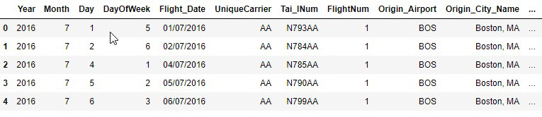

```{r setup, include=FALSE}
knitr::opts_chunk$set(echo = TRUE)
```


Hi das ist ein Python Test ...

```{r results='hide', message=FALSE, warning=FALSE}
library(tidyverse)
```


```{r}
red <- read.csv(url("http://archive.ics.uci.edu/ml/machine-learning-databases/wine-quality/winequality-red.csv"), sep = ";")
```


```{r, eval=F, echo=T}
flight.head()
```





